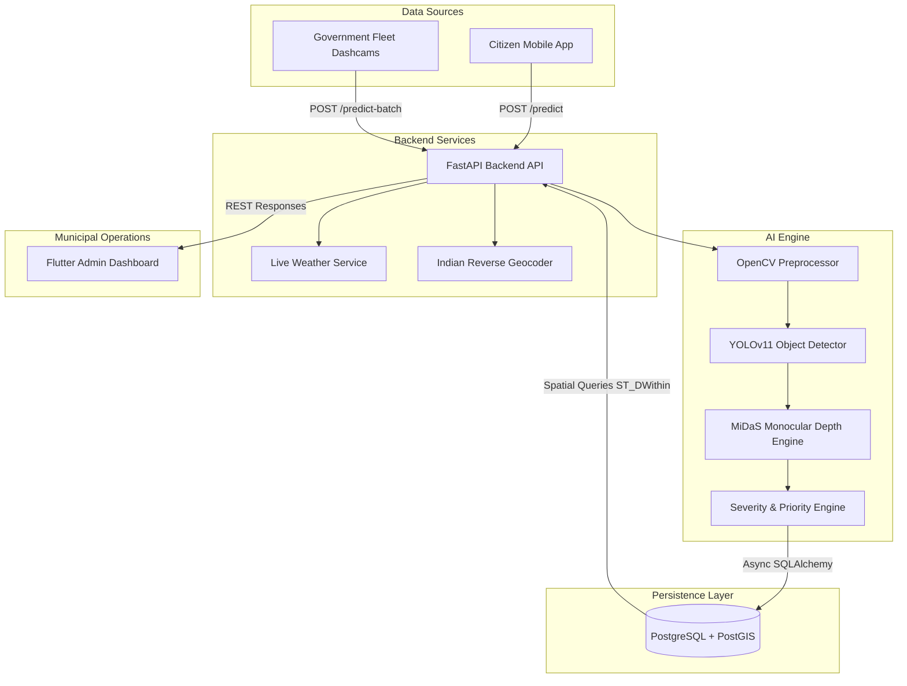

<div align="center">

# RoadVision

### **AI-Powered Intelligent Road Damage Detection & Monitoring System**

[](LICENSE)
[](https://flutter.dev)
[](https://fastapi.tiangolo.com)
[](https://www.python.org)
[](https://pytorch.org)
[](https://www.postgresql.org)
[](https://postgis.net)
[](https://www.docker.com)

*An end-to-end Smart City MLOps platform combining mobile crowdsourcing, continuous municipal fleet telematics, YOLOv11 Computer Vision, MiDaS 3D Monocular Depth Estimation, and PostGIS spatial buffer analytics to automate road maintenance.*

</div>

---

## Project Overview

Traditional municipal road inspections rely on visual surveys that are manual, slow, expensive, and reactive. By the time potholes or structural pavement cracks are identified, water ingress has worsened erosion, leading to higher repair budgets and vehicle damage.

**RoadVision** solves this problem by automating urban road surface inspection through dual data channels:
1. **Citizen Crowdsourcing**: Citizens capture pavement damage photos using a Flutter mobile app. GPS coordinates and reverse-geocoded Indian addresses are attached automatically.
2. **Continuous Government Fleet Surveillance**: Municipal vehicles (garbage collection trucks, public buses) continuously record road conditions via dashboard cameras, transmitting telematics frames every 5 seconds over 4G/5G networks.

The system processes incoming imagery through a multi-stage AI pipeline, calculates 3D metric dimensions (width, length, depth in $cm$, surface area), computes a **Road Health Score (0–100%)**, applies a **Weather Rain Hazard Priority Boost**, deduplicates defects within 10 meters using **PostGIS**, and routes verified complaints to municipal engineers through an interactive admin dashboard.

---

## Key Features

### Citizen Mobile Application
- **Instant Camera & Gallery Capture**: Capture high-resolution pavement photos with automatic device camera optimization.
- **Automated GPS & Indian Geocoding**: Captures latitude and longitude while displaying familiar Indian road addresses (*"Anna Salai, Teynampet, Chennai, Tamil Nadu"*).
- **Real-Time AI Inspection Output**: Instant feedback displaying defect classification, severity rating, and an **AI Confidence Progress Bar** (`██████████░░ 96.4%`).
- **Live Weather Hazard Banner**: Displays local ambient temperature, humidity, visibility, and rain probability risk.
- **8-Stage Visual Timeline**: Tracks complaint progression from `Reported` to `Closed`.
- **Before & After Photo Comparison**: Side-by-side visual verification of resurfaced road defects.

### Government Fleet Surveillance
- **Continuous Dashcam Telematics**: Ingests automated frame streams captured by public transit buses and municipal inspection vehicles.
- **Vehicle Telematics Metadata**: Attaches Vehicle ID (`TN01-GOV-024`), Department, Camera ID, Driver Name, Inspection Route, and Shift.
- **High-Throughput Batch Processing**: Asynchronous ingestion pipeline designed for continuous urban fleet operations.

### Core AI & Vision Engine
- **YOLOv11 Multi-Class Detection**: Detects Potholes, Longitudinal Cracks, Transverse Cracks, Alligator Cracks, Surface Damage, and Road Edge Failures.
- **MiDaS Monocular Depth Estimation**: Generates 3D depth map gradients from 2D RGB photos, estimating physical width ($m$), length ($m$), surface area ($m^2$), and depth ($cm$).
- **Road Health Score Engine (0–100%)**: Dynamically rates road segment health (**Excellent**, **Good**, **Fair**, **Poor**, **Critical**).
- **Weather Hazard Priority Boost**: Automatically adds a **+15 Point Priority Boost** when heavy monsoon rainfall is detected to prioritize waterlogged defects.

### Administrator Dashboard & GIS Map
- **Municipal Workorder Dispatching**: View, verify, assign contractors, and manage the 8-stage repair lifecycle.
- **Interactive OpenStreetMap GIS Map**: Visualizes defect pins with custom severity markers and popups.
- **Density Heatmaps**: Highlights municipal critical hazard hotspots categorized by risk level.
- **Advanced Executive Analytics**: Visualizes total scanned kilometers, average AI accuracy, average repair SLA, and damage type distribution.

---

## System Architecture



---

## AI Pipeline Flowchart


---

## Technology Stack

| Component | Framework / Library | Primary Purpose |
| :--- | :--- | :--- |
| **Mobile Frontend** | Flutter 3.x, Dart | Unified Citizen & Administrator cross-platform mobile application |
| **Backend Web Framework** | FastAPI, Uvicorn, Pydantic | High-performance asynchronous REST API framework |
| **Programming Language** | Python 3.10+ | Primary language for AI pipeline and backend web services |
| **Object Detection Model** | YOLOv11 / PyTorch / Ultralytics | Real-time multi-class pavement defect classification |
| **3D Depth Estimation** | MiDaS (v3.0 DPT) | Dense monocular depth map generation from 2D imagery |
| **Computer Vision** | OpenCV, Albumentations | CLAHE contrast enhancement and bilateral noise filtering |
| **Relational Database** | PostgreSQL 15 | Enterprise relational database storage |
| **Spatial Database Extension** | PostGIS 3.3 | Sub-10m spatial buffer joins (`ST_DWithin`) and spatial indexing |
| **Database ORM** | Async SQLAlchemy 2.0, asyncpg | Non-blocking asynchronous database access layer |
| **GIS Mapping** | OpenStreetMap, FlutterMap, Leaflet | Map rendering, spatial heatmaps, and coordinate display |
| **Containerization** | Docker, Docker Compose | Multi-container orchestration (FastAPI + PostGIS + Redis) |
| **CI/CD Pipeline** | GitHub Actions | Automated integration testing and mobile build automation |

---

## Repository Structure

```
RoadVision/
├── .github/              # CI/CD automation workflows for testing and builds
├── ai/                   # Core computer vision, YOLOv11, MiDaS, and weather modules
├── backend/              # FastAPI application launcher, API routes, and Pydantic schemas
├── database/             # PostgreSQL DDL schemas, Async SQLAlchemy models, and PostGIS layer
├── dataset/              # Dataset preparation utilities for RDD2022 dataset conversion
├── docker/               # Production Dockerfiles and Docker Compose configuration
├── docs/                 # Architectural diagrams, SRS specs, and review defense manuals
├── flutter_app/          # Unified Flutter mobile application (Citizen & Admin views)
├── .env.example          # Template environment variable configuration file
├── .gitignore            # Git exclusion patterns for credentials and binaries
├── LICENSE               # Open-source MIT license file
├── README.md             # System documentation and project manual
├── requirements.txt      # Python dependencies list
└── test_inference.py     # Integration test script for pipeline verification
```

---

## Database & Spatial Design

RoadVision utilizes **PostgreSQL 15** with the **PostGIS 3.3** spatial extension to deliver enterprise GIS capabilities:
- **Spatial Coordinates**: Internal coordinates are stored as `GEOMETRY(Point, 4326)` spatial objects for exact spatial indexing.
- **Sub-10m Spatial Deduplication**: Executes PostGIS `ST_DWithin` geography queries to detect whether a reported defect has already been submitted within a 10-meter radius, automatically incrementing verification counts rather than creating duplicate records.
- **Spatial GIST Indexing**: Utilizes `idx_damage_reports_geom` GIST indexes for sub-10ms spatial query execution.
- **Privacy Layer**: Raw floating-point GPS coordinates remain internal; user interfaces display human-readable Indian addresses reverse-geocoded via OpenStreetMap Nominatim.

---

## API Overview

The FastAPI backend exposes interactive OpenAPI / Swagger documentation at `http://localhost:8000/docs`.

### Core Endpoints
- `POST /api/v1/predict` (or `/api/v1/citizen/upload`): Accepts image file and GPS location; executes full AI pipeline and returns detection payload.
- `POST /api/v1/predict-batch`: High-throughput ingestion endpoint for continuous government fleet dashcam frame streams.
- `GET /api/v1/admin/complaints`: Fetches active municipal complaints sorted by priority score.
- `PUT /api/v1/admin/repair-complete/{complaint_id}`: Uploads after-repair verification photo and updates complaint status to `Completed`.
- `GET /api/v1/admin/analytics`: Computes executive KPI metrics, scanned road coverage, and defect distributions.
- `GET /health`: System health check endpoint.

---

## Installation & Setup

### Prerequisites
- Python 3.10+
- Flutter SDK (3.x)
- Docker Desktop & Docker Compose
- PostgreSQL 15 with PostGIS extension (if running locally without Docker)

### 1. Clone Repository
```bash
git clone https://github.com/mubeenah-collab/AI-powered-roadcare.git
cd AI-powered-roadcare
```

### 2. Backend Setup
```bash
# Create virtual environment
python -m venv venv
source venv/bin/activate  # On Windows: venv\Scripts\activate

# Install Python dependencies
pip install -r requirements.txt
```

### 3. Flutter Setup
```bash
cd flutter_app
flutter pub get
```

---

## Running the Project

### Option A: Running with Docker Compose (Recommended)
```bash
docker-compose -f docker/docker-compose.yml up --build
```
The FastAPI backend will be accessible at `http://localhost:8000`.

### Option B: Running Locally

#### 1. Launch FastAPI Backend
```bash
python backend/main.py
```

#### 2. Run Flutter Mobile App
```bash
cd flutter_app
flutter run
```

#### 3. Run AI Inference Test Script
```bash
python test_inference.py
```

---

## Application Screenshots & Interface

| Citizen Inspection Screen | Live Weather Impact | Complaint Timeline |
| :---: | :---: | :---: |
| *(Pothole Detection & AI Confidence Bar)* | *(Monsoon Rain Risk & Priority Boost)* | *(8-Stage Municipal Repair Progress)* |

| Admin Executive Overview | Interactive GIS Map | Before & After Repair |
| :---: | :---: | :---: |
| *(Scanned Kilometers & SLA Metrics)* | *(OpenStreetMap Hotspot Clusters)* | *(Resurfaced Asphalt Audit)* |

---

## Future Enhancements

- **Autonomous Drone Inspection**: Extend ingestion pipeline to process high-altitude aerial imagery captured by municipal survey drones.
- **Predictive Degradation Modeling**: Implement MLOps time-series algorithms to predict pavement structural failure prior to pothole formation.
- **Edge-AI Offline Inference**: Export YOLOv11 models to ONNX / TensorRT / TFLite for offline inference directly on mobile hardware.
- **Multi-Language Support**: Localization support for regional Indian languages across municipal management dashboards.
- **IoT Acceleration Sensors**: Integrate vehicle accelerometer telematics to detect physical impact bumps automatically.

---

## Contributors

Contributions are welcome! Please review `CONTRIBUTING.md` before submitting pull requests.

---

## License

This project is licensed under the **MIT License** - see the [LICENSE](LICENSE) file for details.

---

## Acknowledgements

- [Ultralytics YOLO](https://github.com/ultralytics/ultralytics) for real-time object detection architecture.
- [Intel ISL MiDaS](https://github.com/isl-org/MiDaS) for monocular 3D depth estimation models.
- [FastAPI](https://fastapi.tiangolo.com/) for high-performance Python web framework.
- [Flutter](https://flutter.dev/) for cross-platform mobile UI development.
- [PostGIS](https://postgis.net/) for enterprise spatial database extensions.
- [OpenStreetMap](https://www.openstreetmap.org/) & Nominatim for global geocoding services.
