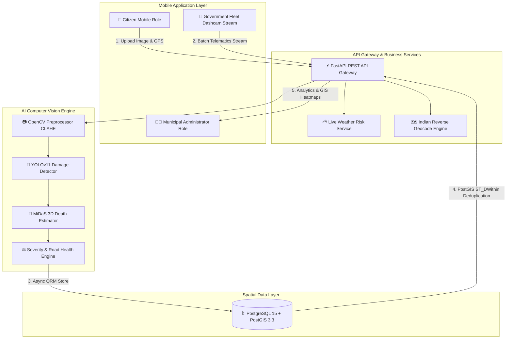
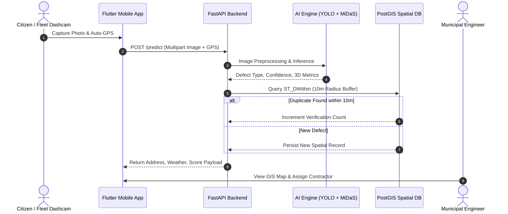
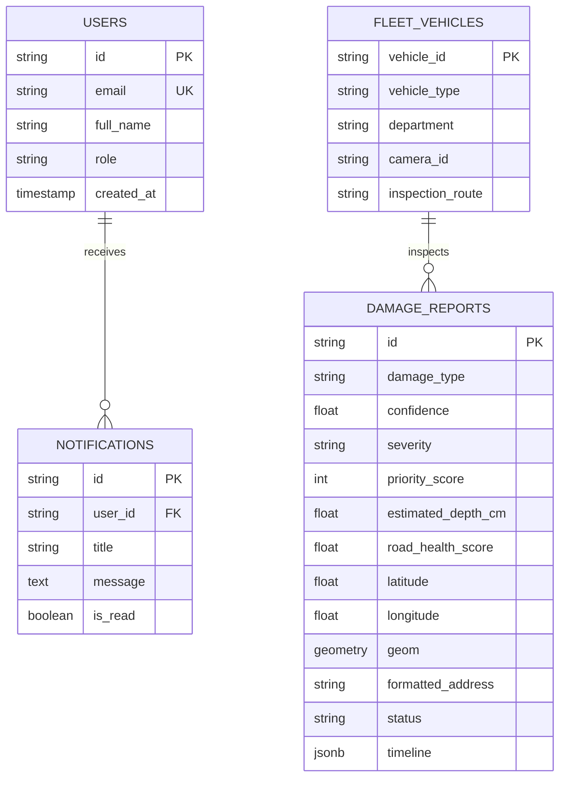

<div align="center">

# 🛣️ RoadVision

### **AI-Powered Intelligent Road Damage Detection & Monitoring System**

*A mobile-first Smart City AI solution for automated road defect inspection, crowdsourced citizen reporting, continuous municipal fleet surveillance, and 3D depth spatial analytics.*

<br/>

[](LICENSE)
[](https://flutter.dev)
[](https://fastapi.tiangolo.com)
[](https://www.python.org)
[](https://pytorch.org)
[](https://www.postgresql.org)
[](https://postgis.net)
[](https://www.docker.com)

</div>

---

## 📌 Project Overview

**RoadVision** is an intelligent road damage detection and monitoring platform designed to transform municipal road maintenance from a manual, reactive process into an automated, data-driven Smart City solution. 

The system leverages dual independent data collection channels:
1. **Citizen Crowdsourcing**: Citizens capture pavement damage using their mobile camera. GPS coordinates are automatically recorded, and human-readable Indian addresses are generated while AI instantly diagnoses damage type, severity, and metric dimensions.
2. **Continuous Government Fleet Surveillance**: Dashboard cameras installed on municipal vehicles (public buses, garbage collection trucks, municipal inspection vans) continuously record road conditions while driving daily routes, transmitting telematics frames over 4G/5G networks.

By combining real-time computer vision, 3D monocular depth estimation, weather risk analysis, and spatial GIS deduplication, RoadVision enables public works departments to prioritize repairs, optimize municipal budgets, and eliminate manual road inspection overhead.

---

## ⚠️ Problem Statement

Conventional municipal road inspections suffer from critical operational challenges:
- **Manual & Labor-Intensive**: Visual surveys require human inspectors to drive thousands of kilometers, making comprehensive coverage impossible.
- **Reactive Repair Cycles**: By the time potholes or structural cracks are identified, water ingress and traffic loads have expanded damage, leading to severe vehicle accidents and inflated repair costs.
- **Inconsistent Citizen Reporting**: Complaints submitted through phone calls or forms lack precise spatial coordinates, depth metrics, or standardized severity ratings.
- **Duplicate Resource Allocation**: Multiple citizens often report the same pothole, resulting in redundant municipal site visits and fragmented tracking.

---

## 🎯 Objectives

- **Automate Pavement Inspection**: Eliminate manual visual surveys using real-time Computer Vision.
- **Enable Dual-Channel Ingestion**: Seamlessly combine crowdsourced mobile reports with continuous municipal fleet surveillance telematics.
- **3D Metric Estimation**: Compute physical width ($m$), length ($m$), area ($m^2$), depth ($cm$), and road occupancy percentage using monocular depth estimation.
- **Weather-Aware Risk Scoring**: Dynamically boost repair priority when heavy monsoon rainfall is detected to prevent rapid pavement erosion.
- **Spatial Deduplication**: Utilize PostGIS spatial indexing to deduplicate defects within a 10-meter radius automatically.
- **End-to-End Lifecycle Tracking**: Provide an 8-stage repair workflow with Before & After photo verification.

---

## ✨ Key Features

### 📱 Citizen Mobile Application
- **Mobile-First Experience**: Flutter cross-platform mobile application supporting Citizen and Administrator role-based authentication.
- **Camera & Gallery Upload**: Instant image capture with camera focus optimization and gallery pick support.
- **Automated GPS & Indian Address Resolution**: Automatically captures latitude and longitude while displaying human-readable Indian addresses (*"Anna Salai, Teynampet, Chennai, Tamil Nadu"*).
- **AI Damage Diagnosis**: Instant visual feedback featuring an **AI Confidence Bar** (`██████████░░ 96.4%`) with dynamic color indicators.
- **Live Weather Hazard Banner**: Displays local ambient temperature, humidity, visibility, and rain risk level.
- **Visual Repair Timeline**: Tracks complaint progress step-by-step from `Reported` to `Closed`.
- **Before & After Repair Comparison**: Side-by-side visual verification of repaired road surfaces.

### 🚌 Government Fleet Surveillance Module
- **Continuous Dashcam Streaming**: Ingests automated frame streams captured by municipal buses and garbage trucks.
- **Fleet Telematics Metadata**: Attaches Vehicle ID (`TN01-GOV-024`), Vehicle Type, Department, Camera ID, Driver Name, Inspection Route, and Shift.
- **High-Throughput Batch Processing**: Asynchronous ingestion endpoint designed for high-density municipal fleet streams.

### 📊 Administrator Module
- **Executive Analytics Dashboard**: Overview cards tracking total scanned kilometers, average AI accuracy, average repair SLA, and damage type distributions.
- **Interactive GIS Map & Heatmaps**: Visualizes defect markers and density heatmaps categorized by risk levels (Low, Medium, High, Critical).
- **Workorder Lifecycle Dispatch**: Assign contractors, update repair statuses, and manage municipal paving crews.
- **Before/After Verification**: Inspector verification interface for validating completed contractor repairs.

### 🧠 Core AI Pipeline
- **YOLOv11 Multi-Class Detection**: Real-time classification of Potholes, Longitudinal Cracks, Transverse Cracks, Alligator Cracks, Surface Damage, and Road Edge Failures.
- **MiDaS 3D Monocular Depth Estimation**: Computes relative 3D depth maps to estimate physical width, length, surface area, and depth in centimeters.
- **Road Health Score Engine (0–100%)**: Evaluates overall pavement segment health (**Excellent**, **Good**, **Fair**, **Poor**, **Critical**).
- **Severity & Priority Score Matrix**: Evaluates multi-factor priority scores combining defect type, depth, confidence, and weather rain risk.

---

## 🛠️ Technology Stack

| Domain | Technology | Description |
| :--- | :--- | :--- |
| **Mobile Frontend** |  | Unified Cross-Platform Mobile Application (Citizen & Admin Roles) |
| **Backend Web API** |  | High-Performance Asynchronous Python Web API Framework |
| **AI Framework** |  | Deep Learning Framework for Computer Vision Models |
| **Object Detection** |  | Real-time Pavement Damage Multi-Class Detection Engine |
| **3D Depth Engine** |  | Dense Monocular Depth Estimation Model |
| **Computer Vision** |  | CLAHE Contrast Enhancement and Bilateral Noise Filtering |
| **Relational Database** |  | Enterprise Database Engine |
| **Spatial Extension** |  | Spatial Data Storage, GIST Indexing, and 10m Buffer Deduplication |
| **Database ORM** |  | Asynchronous Database Persistence Layer (`asyncpg`) |
| **GIS Mapping** |  | Reverse Geocoding and Map Tile Rendering |
| **Containerization** |  | Multi-Container Orchestration (API + PostGIS + Redis) |
| **CI/CD Pipeline** |  | Automated Integration Testing and Flutter Build Workflow |

---

## 🏛️ System Architecture



---

## 📱 Application Workflow



---

## 🧠 AI Pipeline Workflow

```mermaid
flowchart LR
    A[Raw Road Image] --> B[OpenCV CLAHE Contrast Enhancement]
    B --> C[Bilateral Edge-Preserving Noise Filter]
    C --> D[YOLOv11 Defect Classification]
    D --> E[MiDaS Monocular 3D Depth Estimation]
    E --> F[Metric Calculator: Width, Length, Area, Depth]
    F --> G[Weather Rain Risk Assessment]
    G --> H[Road Health Score Evaluator 0-100%]
    H --> I[PostgreSQL + PostGIS Persistence]
```



---

## 🗄️ Database Spatial Architecture



---

## 📁 Folder Structure

```
RoadVision/
├── .github/ workflows/    # GitHub Actions automated test & build scripts
├── ai/                    # Deep learning models, OpenCV CLAHE, MiDaS depth, & weather engine
├── backend/               # FastAPI application launcher, API routes, and Pydantic schemas
├── database/              # PostgreSQL schema DDL, async SQLAlchemy connection, and ORM models
├── dataset/               # RDD2022 dataset preparation tools and conversion scripts
├── docker/                # Production Dockerfile and multi-container docker-compose stack
├── docs/                  # System diagrams, SRS documentation, and evaluation guides
├── flutter_app/           # Unified Flutter mobile codebase for Citizen & Admin interfaces
├── .env.example           # Configuration template for system environment variables
├── .gitignore             # Exclusion rules for temporary cache and credential files
├── LICENSE                # MIT Open-Source License
├── README.md              # Project documentation manual
├── requirements.txt       # Python dependency specifications
└── test_inference.py      # End-to-end integration pipeline execution test script
```

---

## 📸 Screenshots & UI Previews

<div align="center">

### Mobile Application Views

| Citizen Inspection Portal | Live Weather Hazard Impact | Visual Repair Timeline |
| :---: | :---: | :---: |
|  |  |  |

<br/>

### Administrator Monitoring & Analytics Views

| Executive Dashboard KPIs | OpenStreetMap GIS Heatmap | Before & After Repair Audit |
| :---: | :---: | :---: |
|  |  |  |

</div>

---

## ⚙️ Installation Guide

### Prerequisites
- **Python 3.10+**
- **Flutter SDK 3.x**
- **Docker Desktop** (for containerized deployment)
- **PostgreSQL 15 + PostGIS 3.3** (if running without Docker)

### 1. Clone Repository
```bash
git clone https://github.com/mubeenah-collab/AI-powered-roadcare.git
cd AI-powered-roadcare
```

### 2. Backend Setup
```bash
# Create Python virtual environment
python -m venv venv

# Activate environment (Windows)
venv\Scripts\activate

# Activate environment (Linux/macOS)
source venv/bin/activate

# Install dependencies
pip install -r requirements.txt
```

### 3. Flutter Application Setup
```bash
cd flutter_app
flutter pub get
```

---

## 🚀 Running the System

### Method A: Containerized Deployment (Recommended)
```bash
docker-compose -f docker/docker-compose.yml up --build
```
The FastAPI backend service will start at `http://localhost:8000`. Open Swagger docs at `http://localhost:8000/docs`.

### Method B: Manual Local Startup

#### 1. Start FastAPI Backend
```bash
python backend/main.py
```

#### 2. Start Flutter Mobile App
```bash
cd flutter_app
flutter run
```

#### 3. Run AI Inference Diagnostic Test
```bash
python test_inference.py
```

---

## 📡 API Endpoints Summary

Interactive Swagger OpenAPI documentation is served live at `http://localhost:8000/docs`.

| Method | Endpoint | Description |
| :--- | :--- | :--- |
| `POST` | `/api/v1/predict` | Single road damage inspection, AI diagnosis, and geocoding |
| `POST` | `/api/v1/predict-batch` | Government fleet high-throughput continuous frame ingestion |
| `GET` | `/api/v1/admin/complaints` | Retrieves active municipal complaints sorted by priority score |
| `PUT` | `/api/v1/admin/repair-complete/{id}` | Submits after-repair verification photo and marks repair complete |
| `GET` | `/api/v1/admin/dashboard` | Executive KPI analytics dashboard summary metrics |
| `GET` | `/health` | System health check endpoint |

---

## 🔮 Future Enhancements

- 🛸 **Autonomous Drone Inspection**: Extend pipeline to process high-altitude aerial survey streams.
- 🔮 **Predictive Degradation Modeling**: Implement time-series algorithms to forecast asphalt erosion.
- 📱 **Edge-AI Offline Inference**: Export YOLOv11 models to ONNX / TFLite for offline mobile inference.
- 🌐 **Multi-Language Support**: Localization support for regional Indian languages across dashboards.
- 🛰️ **IoT Telematics Sensors**: Integrate vehicle accelerometer sensors to detect physical impact bumps automatically.

---

## 👥 Contributors

Contributions, issues, and feature requests are welcome! Feel free to check the [issues page](https://github.com/mubeenah-collab/AI-powered-roadcare/issues).

---

## 📜 License

This project is licensed under the **MIT License** - see the [LICENSE](LICENSE) file for details.

---

## 🙏 Acknowledgements

- [Ultralytics YOLO](https://github.com/ultralytics/ultralytics) for real-time object detection architecture.
- [Intel ISL MiDaS](https://github.com/isl-org/MiDaS) for monocular depth estimation models.
- [FastAPI](https://fastapi.tiangolo.com/) for high-performance Python web services.
- [Flutter](https://flutter.dev/) for cross-platform mobile app development.
- [PostGIS](https://postgis.net/) for enterprise spatial database extensions.
- [OpenStreetMap](https://www.openstreetmap.org/) & Nominatim for global geocoding services.
